# Angel
Scholar project about a system designed to reduce children’s accidents at home, make it easier for parents to have a basic medical
record for doctors, stimulate children’s mind, give parents helpful tips and an information list of trusted doctors.
## Features
### Location
Can know children's location at any time and if they get away certain distant, system will notify it, also you can map your house to make children stay in certain rooms 

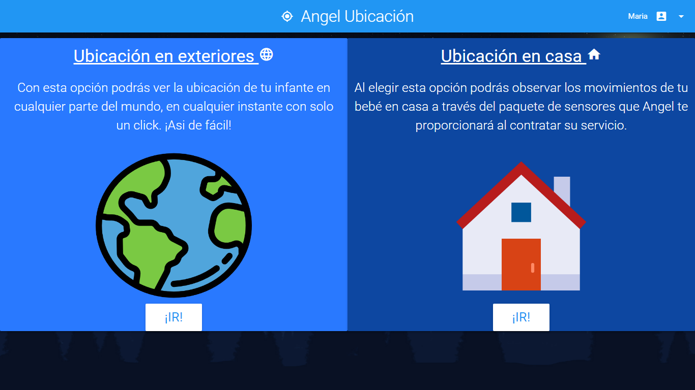 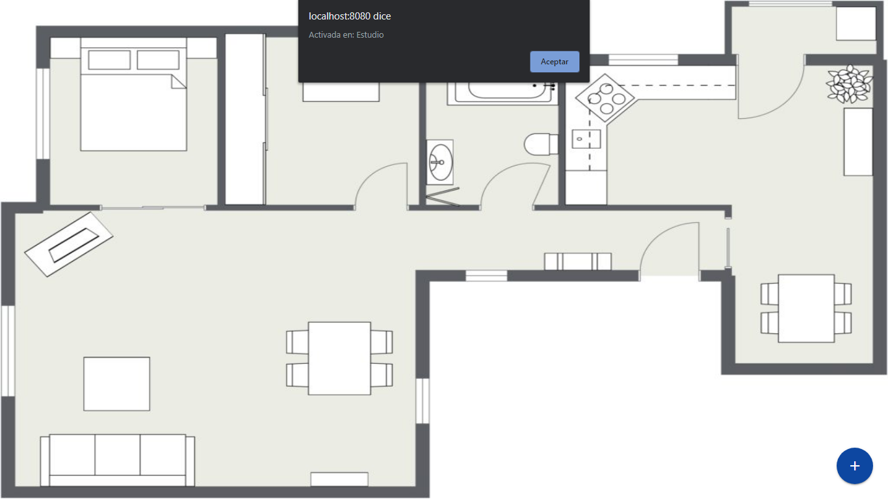 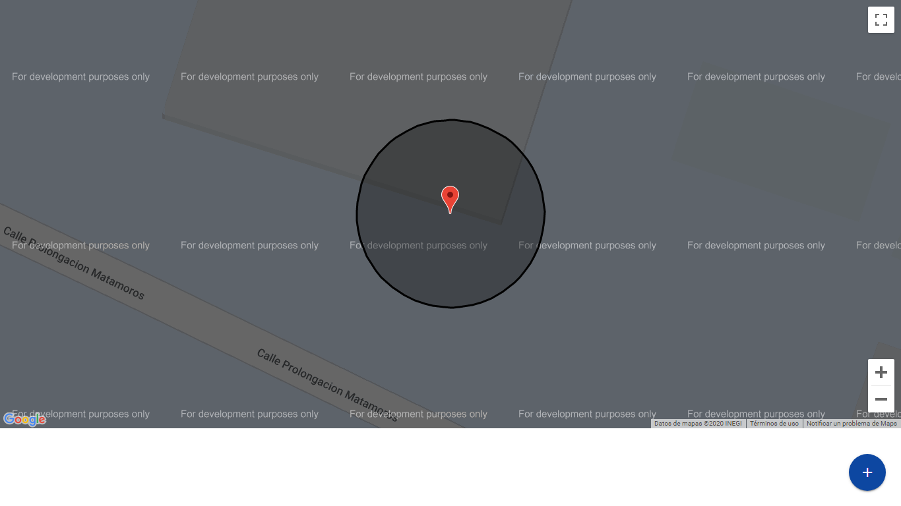

### Medical record
Can fill a simple form that will store with others and create a medical record through time that is printable

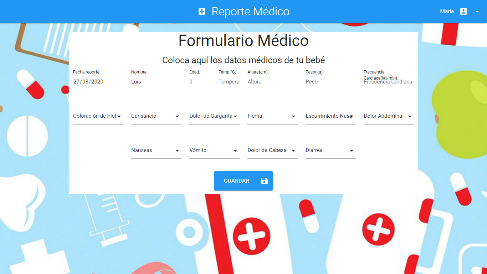 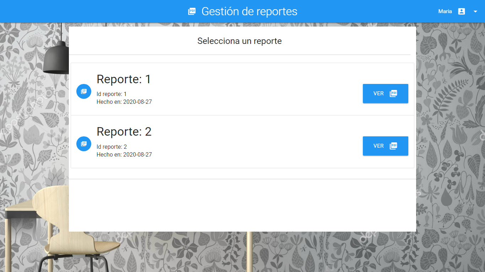 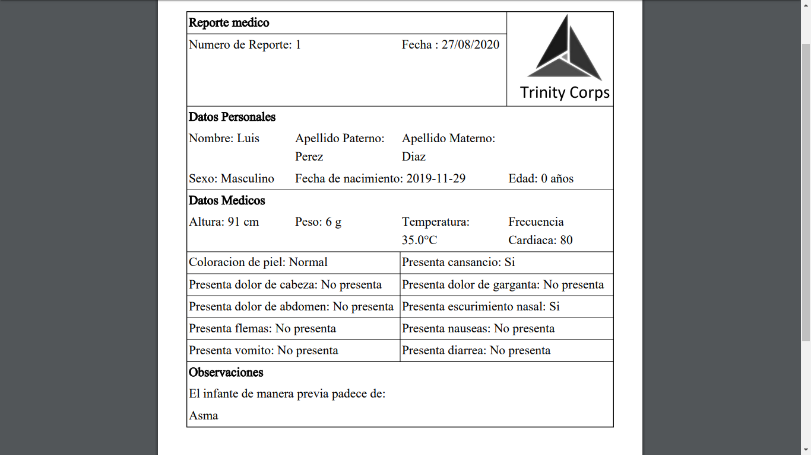

### Mind stimulation
Selected games that stimulates children's mind

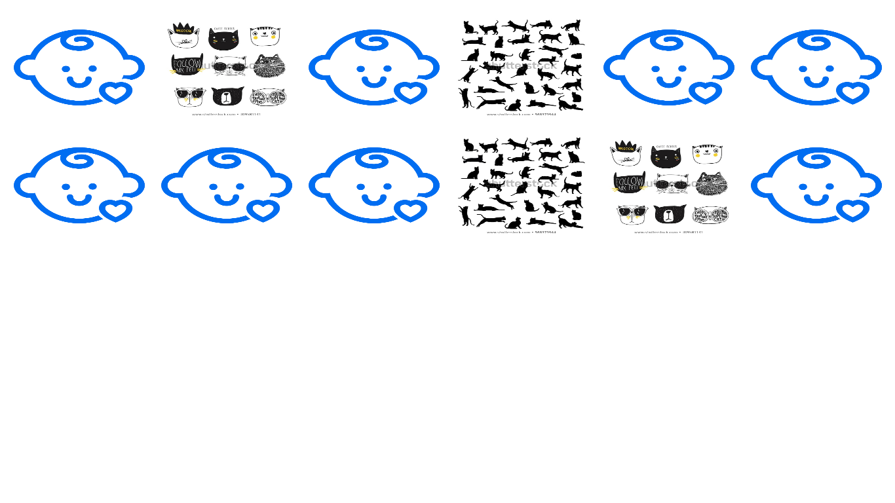 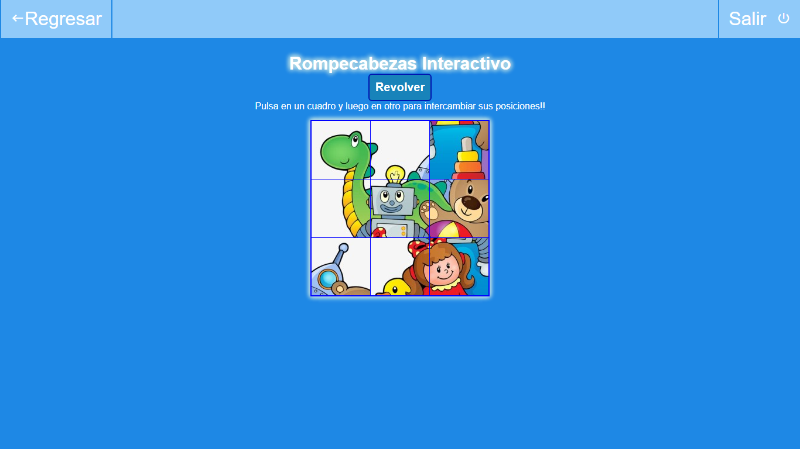
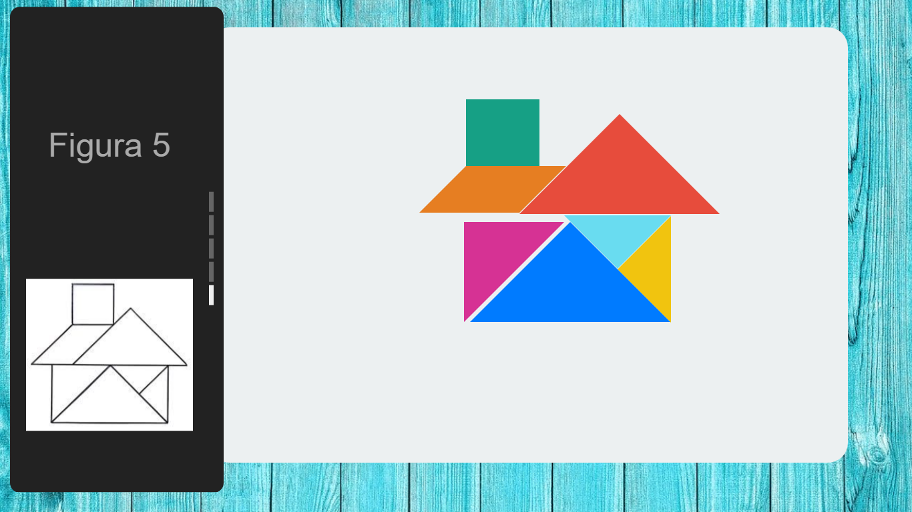 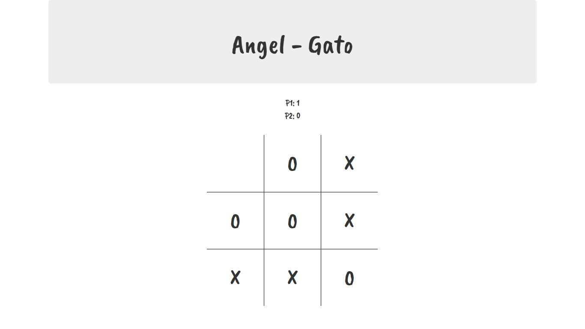

### Tips and doctors information
Helpful tips for parents and a directory of trusted doctors

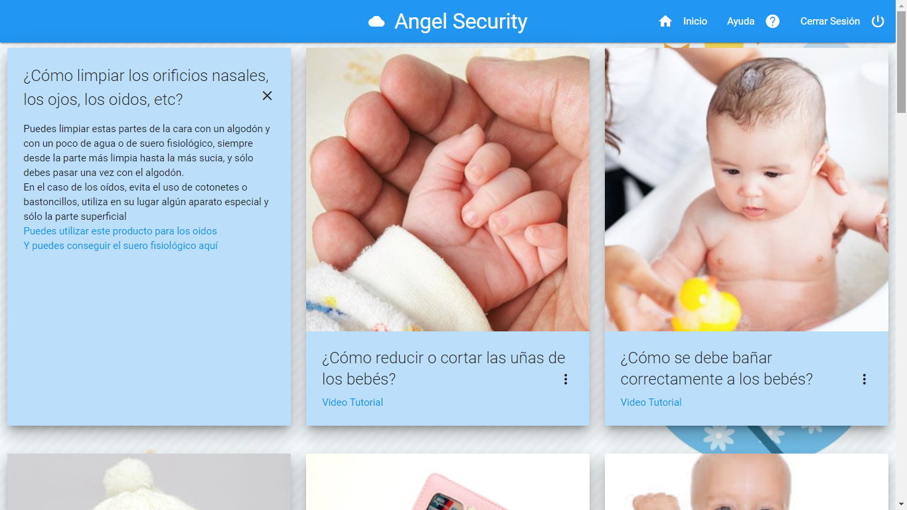 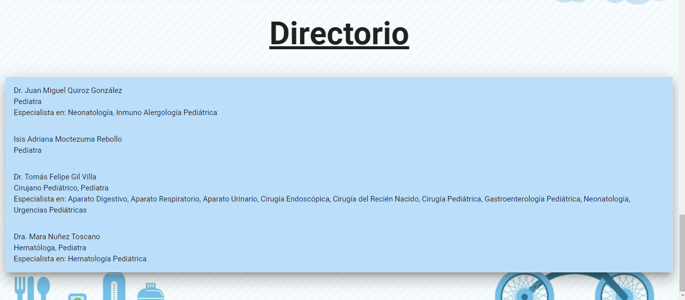

## Notes
Made from 20/2018 to 05/2019
